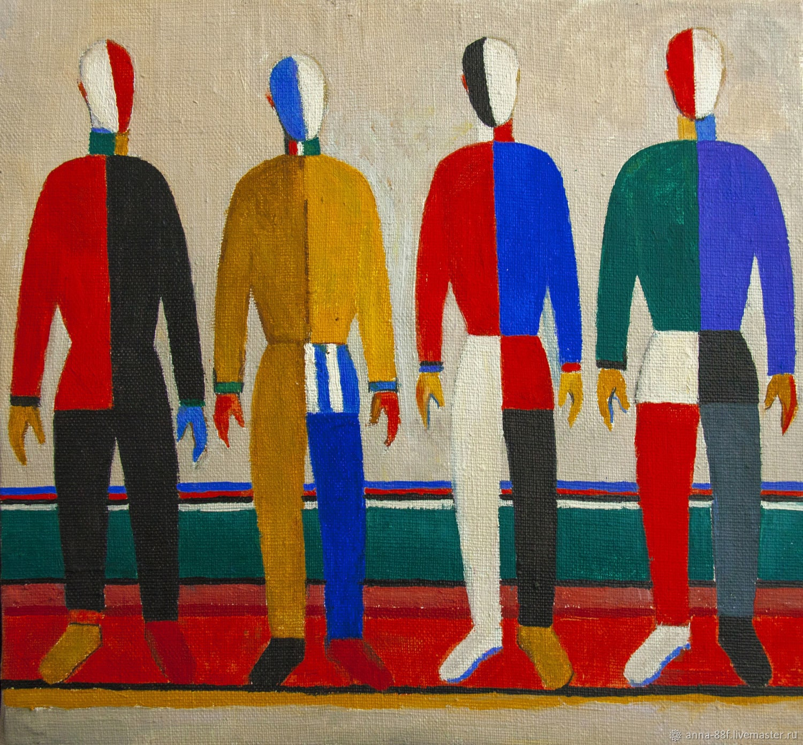

# Консольный "забег"

Данный репозиторий инициализирует:
* спортсменов, 
* припятствия, 
реализует консольную имитацию их прохождения.

Директория `Sportsmen` 
содержит абстрактный класс `Sportsmen`, наследуемые ему абстрактные классы 
`Organism` (с наследниками `Cat`, `Human`) и `Machine` (наследник - `Robot`).
Данные классы описывают испытуемых и накладываемые на них ограничения.
Определяют методы - сообщения о преодолении/непреодолении припятствий,
метод, возвращающий статус преодоления/непреодоления припятствий.

Директория `Let`
содержит абстрактный класс `Let`, наследуемые ему абстрактные классы
`RunningTrack` и `Wall`.
Данные классы описывают припятствия и их размеры.
Определяют метод - вызов, вызывающий внутри себя метод проверки 
прохождения испытания испытуемым.

Класс Main, инициализирует создание испытуемых, препятствий, запускает имитацию
прохождения препятствий.