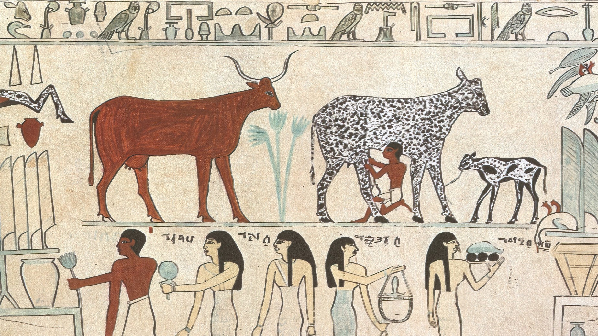

# Быки и коровы

Данный репозиторий реализует игру "Быки и коровы".

### Правила игры:
Быки и коровы — логическая игра, в ходе которой за несколько попыток 
один из игроков должен определить, что задумал другой игрок.  
Варианты игры могут зависеть от типа отгадываемой последовательности — 
это могут быть числа, цвета, пиктограммы или слова. После каждой попытки, 
задумавший игрок выставляет «оценку», указывая количество угаданного 
без совпадения с их позициями (количество «коров») и полных совпадений 
(количество «быков»).  
Роли участников игры не равнозначны — угадывающий 
должен анализировать сделанные попытки и полученные оценки, то есть его 
роль активна. Его партнёр лишь сравнивает очередной вариант с задуманным 
и выставляет оценку по формальным правилам, то есть его роль пассивна. 
Для уравновешивания ролей одновременно играют две встречные партии.

* Пример (загадываемое выражение): <U>1234</U>
* Ввод: <U>1243</U>
* Вывод: <U>4 коровы, 2 быка</U>

### Реализация
В ООП-парадигме она может быть функционально разделена на пакеты:
1. `Game` - пакет реализация механики правил игры:
   1. `GameType` - пакет конкретных реализаций игры с методами - 
   генераторами слов:
       * `CyrillicCharGame` - кириллица;
       * `LatinCharGame` - латиница;
       * `NumberCharGame` - числа;
   * `AbstractGame` - основной класс игры на любом словаре, с методами 
   старта, перезагрузки, управления логированием и ответами для пользователя;
   * `Game` - интерфейс от которого имплементирует класс `AbstractGame` 
   основной функционал;
2. `Service` - пакет служебного функционала игры:
   * `Initiazisation` - класс инициализирует правила игры: размер слова, 
   число попыток, словарь символов;
   * `Answer` - класс ответов для пользователя и подведения итогов игр;
   * `Logger` - класс логирования;

Класс Main, инициализирует правила игры, создаёт и проводит игру, 
в её ходе предоставляя возможность выгрузки статистики, перезапуска игры 
на инициализированных правилах и её завершения.

