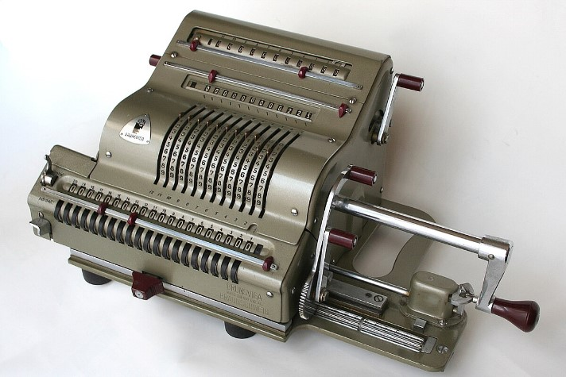

# Калькулятор

Данный репозиторий производит расчёты сумм, произведений, делений и 
бинарного перевода для числовых коллекций (под делением понимаем деление
первого элемента коллекции на последующие).

Результатом служат строки результирующих выражений.
Рассмотрение именно числовых коллекций является допущением в данном задаче, 
при её реализации через перечисления.

1. `Calculator` - класс перечислений, содержащий метод - операции над коллекциями.
2. `Main` - класс создания коллекций и вызова операций над ними.

Реализацию бинарного перевода отрицательных чисел делать прекратил, в связи с тем,
что для этой задачи принципиально определиться в скольки разрядах будет хранится
целочисленная и десятичная части, для её инверсий. Метод инверсии был готов, 
но в связи с тем, что для перевода потребовались бы "магические числа" - удалён.
Такие дела.

P.S. в конце концов даже в Microsoft в своём калькуляторе на это не заморочились.