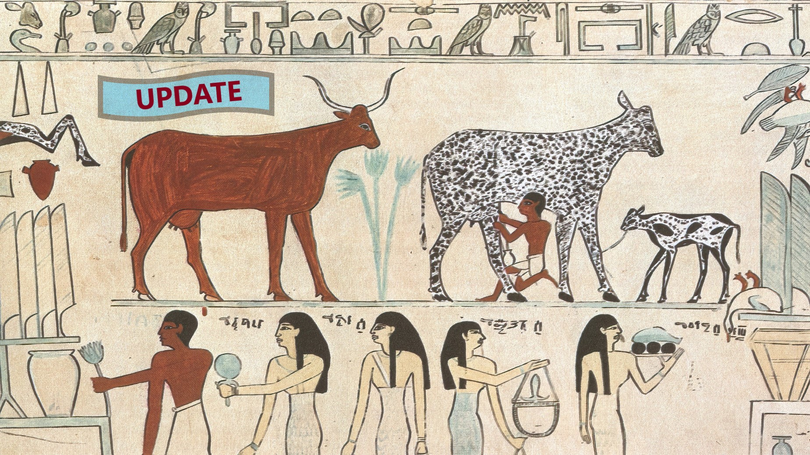

# Быки и коровы

Данный репозиторий реализует игру "Быки и коровы".

### Реализация и паттерн
В основе данной реализации лежат идеи MVSC-паттерна:

1. `controller` - модуль взаимодействия с пользователем (ввод/вывод):
   * `Сontroller` - основной контроллер взаимодействия с `model`, 
управления логированием и ответами для пользователя;
   * `Initiazisation` - вспомогательный контроллер, 
инициализирует правила игры через ввод пользователя:
размер слова, число попыток, словарь символов.

2. `model` - получение пользовательского ввода из модуля `controller`, 
его обработка, инициирование самой игры:
   * `GameType` - пакет конкретных реализаций игры с методами -
   генераторами слов:
     * `CyrillicCharGame` - кириллица;
     * `LatinCharGame` - латиница;
     * `NumberCharGame` - числа;
   * `AbstractGame` - основной класс игры на любом словаре, с методами
   старта, перезагрузки, обработки хода игрока, окончания игры;
   * `AttemptResult` - класс ответа на ход игрока;
   * `Game` - интерфейс от которого имплементирует класс `AbstractGame`
     основной функционал;
   * `GameFactory` - "фабрика" игры, создаёт игру сообразно настройкам 
инициализации;
   * `GameManage` - интерфейс от которого имплементирует класс `AbstractGame` 
   только методы управления игрой (перспективный, под игру EvE);
   * `GameStatus` - класс игровых состояний.
3. `service`:
   * `Logger` событий и действий игрока,
   * `ServiceLogger` - интерфейс логгера, с методами добавления и получения записей.

4. `view` - отображение результатов ввода, получаемое из модуля `controller`,
   * `GameEventView` - отображение игровых событий;
   * `InitializationView` - консольное взаимодействие при задании стартовых настроек;
   * `LoggerView` - publisher логов;

### SOLID
Задачей предполагается комментирование мест с рефакторингом кода в соответствии 
с принципами SOLID. Проект был существенно переработан (использование паттерна уже 
во многом, предполагает следование принципам SOLID), в связи с чем, оставлять 
куски старого кода и их обновление было бы слишком громозким. Лучше дать конкретные 
ссылки.
* `single responsibility principle` - иллюстрацией этого принципа является сам паттерн
проекта. Ранее не было разделения на модули, сейчас есть. Ранее класс `model` публиковал 
сообщения пользователю и управлял логами, теперь первое во `view`, второе в `service`, 
а управляет ими `controller`. Тоже самое касается отдельных методов. К примеру `addStartGameNote()` - 
добавление записи о начале игры или `printNewAttemptMessage` - печать сообщения перед новым ходом, 
делают именно это и ничего другого.
* `open-closed principle` - интерфейс `ServiceLogger` допускает возможность реализации иного,
отличного от `Logger`, логгера. Логгер и вью не получают объектов из других модулей и 
независимы от них.
* `Liskov substitution principle` - в программе нет случаев приведения объектов дочернего класса 
к материнскому, нет указателей на материнский класс, нет нужды одному наследнику знать о другом.
* `interface segregation principle` - интерфейсы `Game` и `GameManage` созданы под разные задачи.
* `dependency inversion principle` - материнский класс `AbstractGame` не зависит от конкретного 
режима игры, игра идёт на любом словаре. Но в то же время, этот абстрактный класс определяет 
ход любой игры.

### Правила игры:
Быки и коровы — логическая игра, в ходе которой за несколько попыток
один из игроков должен определить, что задумал другой игрок.  
Варианты игры могут зависеть от типа отгадываемой последовательности —
это могут быть числа, цвета, пиктограммы или слова. После каждой попытки,
задумавший игрок выставляет «оценку», указывая количество угаданного
без совпадения с их позициями (количество «коров») и полных совпадений
(количество «быков»).  
Роли участников игры не равнозначны — угадывающий
должен анализировать сделанные попытки и полученные оценки, то есть его
роль активна. Его партнёр лишь сравнивает очередной вариант с задуманным
и выставляет оценку по формальным правилам, то есть его роль пассивна.
Для уравновешивания ролей одновременно играют две встречные партии.

* Пример (загадываемое выражение): <U>1234</U>
* Ввод: <U>1243</U>
* Вывод: <U>4 коровы, 2 быка</U>